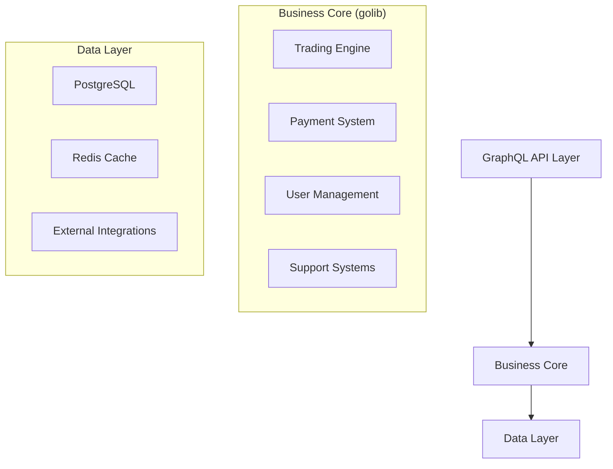

# Backend Knowledge Transfer Documentation

This repository contains knowledge transfer documentation for [cbapp/monorepo](https://github.com/cbapp/monorepo). The goal is to provide clear, trackable documentation of critical system knowledge.

## System Architecture



## Repository Structure
```
.
├── sessions/              # Detailed session documentation
│   └── 2024-12-11/       # Organized by date
│       ├── 01-graphql-api-architecture.md
│       ├── 02-third-party-integrations.md
│       ├── 03-security-analysis.md
│       └── 04-database-analysis.md
└── system/               # Core system documentation
    ├── 01-overview.md    # System architecture & components
    ├── 02-critical-flows.md
    ├── 03-known-issues.md
    └── 04-maintenance.md
```

## Quick Links
- [System Overview](./system/01-overview.md)
- [Critical Flows](./system/02-critical-flows.md)
- [Known Issues](./system/03-known-issues.md)
- [Maintenance Guide](./system/04-maintenance.md)
- [Future Improvements](./FutureProspects.md)

## Key Areas

### Core Components
- **Trading Engine**: Order processing & price management
- **Payment System**: Gateway integrations & transactions
- **User Management**: Authentication & KYC flows
- **Data Layer**: PostgreSQL & Redis cache

### Critical Flows
- Trading: `Order → Validation → Price Check → Balance Check → Execution`
- Payments: `Intent → Gateway → Processing → Balance Update`
- KYC: `Document Upload → Validation → Status Update`

## Documentation Guidelines

### For New Sessions
1. Create dated directory in `sessions/`
2. Use templates from `system/templates/`
3. Document key decisions and rationale
4. Link relevant code examples

### For System Docs
1. Major changes need PR
2. Minor fixes direct to main
3. Keep maintenance guide current
4. Link to main repo code

## High Priority Areas
1. **Performance**
   - Query optimization
   - Cache improvements
   - Connection pooling

2. **Code Quality**
   - Model consolidation
   - Error handling patterns
   - Business logic separation

3. **Monitoring**
   - Test coverage
   - Production metrics
   - Debug logging

For detailed improvement plans, see [FutureProspects.md](./FutureProspects.md).

## Reference
Main repository: https://github.com/cbapp/monorepo

---
*Note: Keep documentation current with regular updates. Small, frequent updates are better than large, irregular ones.*
